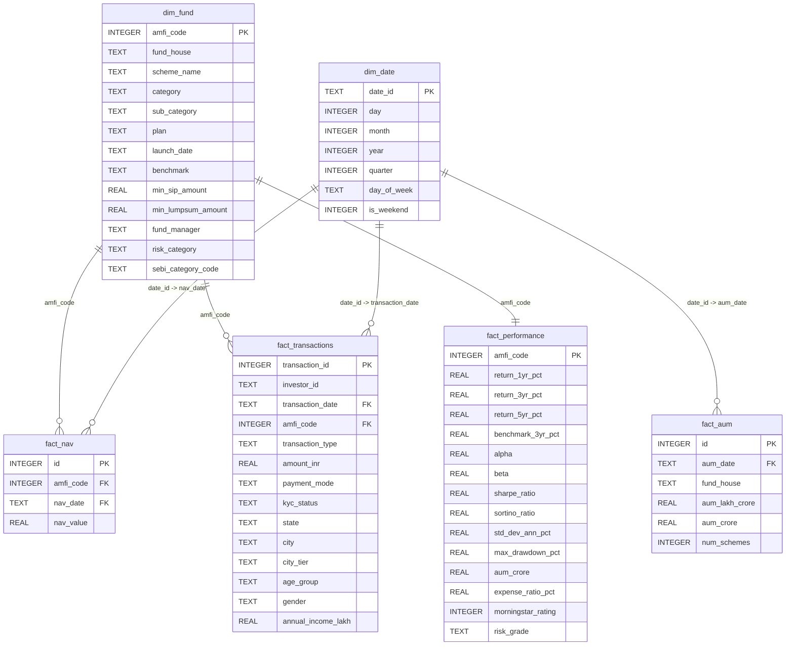

# Data Dictionary — Bluestock MF SQLite Database

This document provides the database schema reference, data types, constraints, and business definitions for all 11 tables stored in `bluestock_mf.db` (including the 6 Star Schema tables and 5 auxiliary supporting tables).

---

## 1. Star Schema Relationship Diagram (Mermaid)

---

## 2. Dimension Tables

### `dim_fund`
Stores static properties and metadata of the mutual fund schemes.
* **Source Reference**: `01_fund_master.csv`

| Column Name | Data Type (SQLite) | Key Type | Nullability | Business Definition / Description |
| :--- | :--- | :--- | :--- | :--- |
| `amfi_code` | `INTEGER` | **PK** | NOT NULL | Unique AMFI code identifying the scheme |
| `fund_house` | `TEXT` | None | NULL | Name of the Asset Management Company (AMC) |
| `scheme_name` | `TEXT` | None | NOT NULL | Official name of the mutual fund scheme |
| `category` | `TEXT` | None | NULL | Broad asset class category (e.g. Equity, Debt) |
| `sub_category` | `TEXT` | None | NULL | Detailed category division (e.g. Large Cap, Small Cap, Gilt) |
| `plan` | `TEXT` | None | NULL | Purchase plan option (`Direct` / `Regular`) |
| `launch_date` | `TEXT` | None | NULL | Launch/Inception date of the scheme (`YYYY-MM-DD`) |
| `benchmark` | `TEXT` | None | NULL | Benchmark index used for returns comparison |
| `min_sip_amount` | `REAL` | None | NULL | Minimum required amount for monthly SIP |
| `min_lumpsum_amount` | `REAL` | None | NULL | Minimum required amount for one-time lumpsum investment |
| `fund_manager` | `TEXT` | None | NULL | Primary manager directing the fund |
| `risk_category` | `TEXT` | None | NULL | Risk rating classification from fund master |
| `sebi_category_code` | `TEXT` | None | NULL | Standard SEBI classification code (e.g. EC01) |

---

### `dim_date`
A shared calendar dimension containing attributes for date-based aggregations.
* **Source Reference**: Dynamically generated from date fields in NAV and transaction datasets.

| Column Name | Data Type (SQLite) | Key Type | Nullability | Business Definition / Description |
| :--- | :--- | :--- | :--- | :--- |
| `date_id` | `TEXT` | **PK** | NOT NULL | ISO date string (`YYYY-MM-DD`) |
| `day` | `INTEGER` | None | NULL | Day of the month (1-31) |
| `month` | `INTEGER` | None | NOT NULL | Numeric month of the year (1-12) |
| `year` | `INTEGER` | None | NOT NULL | Calendar year (e.g. 2024) |
| `quarter` | `INTEGER` | None | NOT NULL | Numeric calendar quarter (1-4) |
| `day_of_week` | `TEXT` | None | NULL | Name of day of the week (e.g. Monday, Sunday) |
| `is_weekend` | `INTEGER` | None | NULL | Indicator: `1` for Saturday/Sunday, `0` for weekdays |

---

## 3. Fact Tables

### `fact_nav`
Daily Net Asset Value records for each scheme. Missing weekend/holiday rows are forward-filled.
* **Source Reference**: `02_nav_history.csv`

| Column Name | Data Type (SQLite) | Key Type | Nullability | Business Definition / Description |
| :--- | :--- | :--- | :--- | :--- |
| `id` | `INTEGER` | **PK** | NOT NULL | Auto-incrementing primary key |
| `amfi_code` | `INTEGER` | **FK** | NOT NULL | References `dim_fund(amfi_code)` |
| `nav_date` | `TEXT` | **FK** | NOT NULL | References `dim_date(date_id)` |
| `nav_value` | `REAL` | None | NOT NULL | Price of one unit of the scheme on that date |

* **Constraints**: `UNIQUE (amfi_code, nav_date)`

---

### `fact_transactions`
Granular records of investor transactions (SIP, Lumpsum, and Redemptions) containing demographic properties.
* **Source Reference**: `08_investor_transactions.csv`

| Column Name | Data Type (SQLite) | Key Type | Nullability | Business Definition / Description |
| :--- | :--- | :--- | :--- | :--- |
| `transaction_id` | `INTEGER` | **PK** | NOT NULL | Auto-incrementing transaction primary key |
| `investor_id` | `TEXT` | None | NOT NULL | Unique system identifier for the investor |
| `transaction_date`| `TEXT` | **FK** | NOT NULL | References `dim_date(date_id)` |
| `amfi_code` | `INTEGER` | **FK** | NOT NULL | References `dim_fund(amfi_code)` |
| `transaction_type`| `TEXT` | None | NOT NULL | Transaction type (`SIP` / `Lumpsum` / `Redemption`) |
| `amount_inr` | `REAL` | None | NOT NULL | Value of transaction in Indian Rupees |
| `payment_mode` | `TEXT` | None | NULL | Payment mode (`UPI` / `Cheque` / `Net Banking` / `Mandate`) |
| `kyc_status` | `TEXT` | None | NULL | KYC verification status (`Verified` / `Pending`) |
| `state` | `TEXT` | None | NULL | Investor state of residence |
| `city` | `TEXT` | None | NULL | Investor city of residence |
| `city_tier` | `TEXT` | None | NULL | City tier classification (`T30`: Top 30, `B30`: Beyond 30) |
| `age_group` | `TEXT` | None | NULL | Age bracket of investor (e.g. 18-25, 26-35) |
| `gender` | `TEXT` | None | NULL | Investor gender (`Male` / `Female`) |
| `annual_income_lakh`| `REAL` | None | NULL | Investor annual income in INR Lakhs |

---

### `fact_performance`
Periodic performance metrics, returns, risk ratios, and expenses for each scheme.
* **Source Reference**: `07_scheme_performance.csv`

| Column Name | Data Type (SQLite) | Key Type | Nullability | Business Definition / Description |
| :--- | :--- | :--- | :--- | :--- |
| `amfi_code` | `INTEGER` | **PK, FK** | NOT NULL | References `dim_fund(amfi_code)` |
| `return_1yr_pct` | `REAL` | None | NULL | Absolute returns over the past 1 year (%) |
| `return_3yr_pct` | `REAL` | None | NULL | Annualized returns over the past 3 years (%) |
| `return_5yr_pct` | `REAL` | None | NULL | Annualized returns over the past 5 years (%) |
| `benchmark_3yr_pct`| `REAL` | None | NULL | Annualized benchmark index returns over 3 years (%) |
| `alpha` | `REAL` | None | NULL | Excess return above market expectations (Jensen's alpha) |
| `beta` | `REAL` | None | NULL | Measure of systematic risk/volatility relative to benchmark |
| `sharpe_ratio` | `REAL` | None | NULL | Risk-adjusted return measure (volatility-adjusted) |
| `sortino_ratio` | `REAL` | None | NULL | Risk-adjusted return focusing on downside volatility |
| `std_dev_ann_pct` | `REAL` | None | NULL | Annualized standard deviation of returns (volatility) |
| `max_drawdown_pct` | `REAL` | None | NULL | Maximum peak-to-trough drop in scheme NAV (%) |
| `aum_crore` | `REAL` | None | NULL | Current scheme AUM in INR Crore |
| `expense_ratio_pct`| `REAL` | None | NULL | Fund expense ratio in % (bounded between 0.1% and 2.5%) |
| `morningstar_rating`| `INTEGER`| None | NULL | Mutual fund rating out of 5 stars |
| `risk_grade` | `TEXT` | None | NULL | Scheme risk level grade (e.g. Moderate, Very High) |

---

### `fact_aum`
Monthly Assets Under Management aggregated at the AMC (Fund House) level.
* **Source Reference**: `03_aum_by_fund_house.csv`

| Column Name | Data Type (SQLite) | Key Type | Nullability | Business Definition / Description |
| :--- | :--- | :--- | :--- | :--- |
| `id` | `INTEGER` | **PK** | NOT NULL | Auto-incrementing primary key |
| `aum_date` | `TEXT` | **FK** | NOT NULL | References `dim_date(date_id)` (first of month) |
| `fund_house` | `TEXT` | None | NOT NULL | Name of the fund house / AMC |
| `aum_lakh_crore` | `REAL` | None | NULL | AMC AUM in Lakh Crore INR |
| `aum_crore` | `REAL` | None | NULL | AMC AUM in Crore INR |
| `num_schemes` | `INTEGER` | None | NULL | Number of schemes managed by the AMC |

---

## 4. Supporting / Auxiliary Tables

### `portfolio_holdings`
Stock allocation weight and sector details for each scheme's portfolio.
* **Source Reference**: `09_portfolio_holdings.csv`

| Column Name | Data Type (SQLite) | Key Type | Nullability | Business Definition / Description |
| :--- | :--- | :--- | :--- | :--- |
| `amfi_code` | `INTEGER` | None | NOT NULL | AMFI code of the holding scheme |
| `stock_symbol` | `TEXT` | None | NULL | NSE/BSE stock ticker symbol |
| `stock_name` | `TEXT` | None | NULL | Name of the underlying corporate company |
| `sector` | `TEXT` | None | NULL | Industry sector classification |
| `weight_pct` | `REAL` | None | NULL | Scheme's portfolio weight allocation (%) |
| `market_value_cr` | `REAL` | None | NULL | Value of the holding in INR Crores |
| `current_price_inr`| `REAL` | None | NULL | Stock market close price on portfolio date |
| `portfolio_date` | `TEXT` | None | NULL | Date of portfolio snapshot |

---

### `benchmark_indices`
Historical close values for main benchmark indices (e.g. NIFTY50, NIFTY100).
* **Source Reference**: `10_benchmark_indices - 10_benchmark_indices.csv`

| Column Name | Data Type (SQLite) | Key Type | Nullability | Business Definition / Description |
| :--- | :--- | :--- | :--- | :--- |
| `date` | `TEXT` | None | NOT NULL | Date of record (`YYYY-MM-DD`) |
| `index_name` | `TEXT` | None | NOT NULL | Name of index (e.g. NIFTY50, NIFTY100) |
| `close_value` | `REAL` | None | NULL | Close price index point value |

---

### `monthly_sip_inflows`
Monthly industry-level aggregate statistics of SIP inflows and accounts.
* **Source Reference**: `04_monthly_sip_inflows.csv`

| Column Name | Data Type (SQLite) | Key Type | Nullability | Business Definition / Description |
| :--- | :--- | :--- | :--- | :--- |
| `month` | `TEXT` | None | NOT NULL | Year and month (`YYYY-MM`) |
| `sip_inflow_crore` | `REAL` | None | NULL | Total industry SIP inflow in INR Crores |
| `active_sip_accounts_crore`| `REAL` | None | NULL | Active count of SIP accounts in Crores |
| `new_sip_accounts_lakh`| `REAL` | None | NULL | New accounts registered in Lakhs |
| `sip_aum_lakh_crore`| `REAL` | None | NULL | Total industry AUM from SIPs in Lakh Crore INR |
| `yoy_growth_pct` | `REAL` | None | NULL | Year-on-Year inflow growth rate (%) |

---

### `category_inflows`
Monthly net inflow values categorized by broad scheme sub-category.
* **Source Reference**: `05_category_inflows.csv`

| Column Name | Data Type (SQLite) | Key Type | Nullability | Business Definition / Description |
| :--- | :--- | :--- | :--- | :--- |
| `month` | `TEXT` | None | NOT NULL | Year and month (`YYYY-MM`) |
| `category` | `TEXT` | None | NOT NULL | Sub-category name (e.g. Small Cap, Mid Cap) |
| `net_inflow_crore` | `REAL` | None | NULL | Net inflow in INR Crores |

---

### `industry_folio_count`
Monthly industry-wide aggregate folio account totals split by asset category.
* **Source Reference**: `06_industry_folio_count.csv`

| Column Name | Data Type (SQLite) | Key Type | Nullability | Business Definition / Description |
| :--- | :--- | :--- | :--- | :--- |
| `month` | `TEXT` | None | NOT NULL | Year and month (`YYYY-MM`) |
| `total_folios_crore`| `REAL` | None | NULL | Total mutual fund folios in Crores |
| `equity_folios_crore`| `REAL` | None | NULL | Equity folios in Crores |
| `debt_folios_crore` | `REAL` | None | NULL | Debt folios in Crores |
| `hybrid_folios_crore`| `REAL` | None | NULL | Hybrid folios in Crores |
| `others_folios_crore`| `REAL` | None | NULL | Other asset class folios in Crores |
