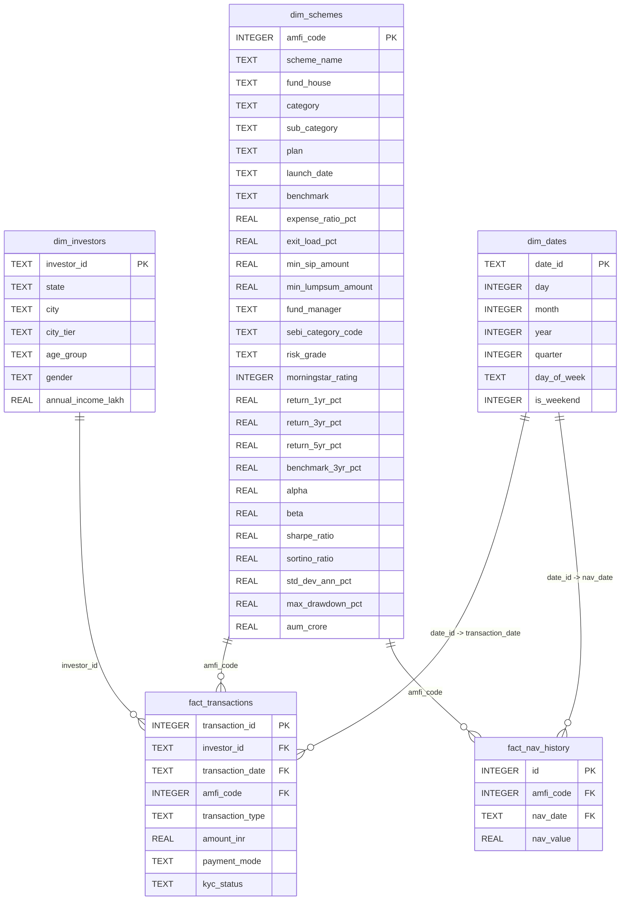

# Data Dictionary — Bluestock MF Capstone Star Schema

This document details the metadata, column descriptions, keys, data types, and constraints for the SQLite Star Schema database (`bluestock_mf.db`) designed for Day 2.

---

## Star Schema Diagram (Conceptual)

---

## Dimension Tables

### 1. `dim_schemes`
Holds comprehensive information for all mutual fund schemes, merging static metadata with returns, risk ratios, and asset-under-management (AUM) values.

| Column Name | SQLite Data Type | Key Type | Nullability | Description | Example Values |
| :--- | :--- | :--- | :--- | :--- | :--- |
| `amfi_code` | `INTEGER` | **PK** | NOT NULL | Unique Association of Mutual Funds in India (AMFI) code | `119551`, `125497` |
| `scheme_name` | `TEXT` | None | NOT NULL | Official name of the mutual fund scheme | `"SBI Bluechip Fund - Regular Plan - Growth"` |
| `fund_house` | `TEXT` | None | NULL | Name of the Asset Management Company (AMC) | `"SBI Mutual Fund"`, `"HDFC Mutual Fund"` |
| `category` | `TEXT` | None | NULL | Broad asset class category | `"Large Cap"`, `"Small Cap"`, `"Debt"`, `"Gilt"` |
| `sub_category` | `TEXT` | None | NULL | Detailed investment focus category | `"Equity - Large Cap"`, `"Debt - Liquid"` |
| `plan` | `TEXT` | None | NULL | Plan type identifier | `"Regular"`, `"Direct"` |
| `launch_date` | `TEXT` | None | NULL | Official inception date of the scheme (`YYYY-MM-DD`) | `"2006-01-12"`, `"2013-01-01"` |
| `benchmark` | `TEXT` | None | NULL | Benchmark index used for comparing performance | `"NIFTY 100 TRI"`, `"NIFTY 50 TRI"` |
| `expense_ratio_pct` | `REAL` | None | NULL | Annual operating expenses as a % of scheme assets | `1.54`, `0.66` |
| `exit_load_pct` | `REAL` | None | NULL | Fee charged when redeeming units before a specified period | `1.0`, `0.0` |
| `min_sip_amount` | `REAL` | None | NULL | Minimum required monthly Systematic Investment Plan amount | `500.0`, `1000.0` |
| `min_lumpsum_amount` | `REAL` | None | NULL | Minimum required one-time investment amount | `5000.0`, `1000.0` |
| `fund_manager` | `TEXT` | None | NULL | Name of the primary professional managing the fund | `"Sohini Andani"`, `"Jinesh Gopani"` |
| `sebi_category_code` | `TEXT` | None | NULL | SEBI standard category code | `"EC01"`, `"EC03"`, `"DC02"` |
| `risk_grade` | `TEXT` | None | NULL | Risk classification score of the fund | `"Moderate"`, `"Very High"`, `"Low"` |
| `morningstar_rating`| `INTEGER`| None | NULL | Star rating assigned by Morningstar (out of 5) | `3`, `4`, `5` |
| `return_1yr_pct` | `REAL` | None | NULL | Absolute return over the past 1 year (%) | `12.42`, `24.56` |
| `return_3yr_pct` | `REAL` | None | NULL | Annualized compound return over 3 years (%) | `12.36`, `23.39` |
| `return_5yr_pct` | `REAL` | None | NULL | Annualized compound return over 5 years (%) | `14.45`, `20.67` |
| `benchmark_3yr_pct` | `REAL` | None | NULL | Annualized benchmark return over 3 years (%) | `11.49`, `22.16` |
| `alpha` | `REAL` | None | NULL | Excess return relative to benchmark return | `0.87`, `1.23` |
| `beta` | `REAL` | None | NULL | Sensitivity of the scheme's return relative to market | `0.89`, `1.04` |
| `sharpe_ratio` | `REAL` | None | NULL | Risk-adjusted return measure (excess return per unit volatility) | `0.88`, `0.94` |
| `sortino_ratio` | `REAL` | None | NULL | Risk-adjusted return focusing on downside volatility | `1.29`, `1.35` |
| `std_dev_ann_pct` | `REAL` | None | NULL | Annualized standard deviation representing volatility (%) | `14.0`, `25.0` |
| `max_drawdown_pct` | `REAL` | None | NULL | Maximum peak-to-trough decline in scheme NAV (%) | `-21.70`, `-13.35` |
| `aum_crore` | `REAL` | None | NULL | Scheme total assets under management in INR Crore | `14288.0`, `19259.0` |

---

### 2. `dim_investors`
Unique investors extracted from transaction history logs containing demographic traits.

| Column Name | SQLite Data Type | Key Type | Nullability | Description | Example Values |
| :--- | :--- | :--- | :--- | :--- | :--- |
| `investor_id` | `TEXT` | **PK** | NOT NULL | Unique system-generated investor identifier | `"INV003054"`, `"INV002952"` |
| `state` | `TEXT` | None | NULL | Indian state of residence for the investor | `"Telangana"`, `"Punjab"`, `"Gujarat"` |
| `city` | `TEXT` | None | NULL | City of residence | `"Hyderabad"`, `"Amritsar"`, `"Ahmedabad"` |
| `city_tier` | `TEXT` | None | NULL | City classification (T30: Top 30, B30: Beyond 30) | `"T30"`, `"B30"` |
| `age_group` | `TEXT` | None | NULL | Age bracket of the investor | `"18-25"`, `"26-35"`, `"56+"` |
| `gender` | `TEXT` | None | NULL | Gender of the investor | `"Male"`, `"Female"` |
| `annual_income_lakh`| `REAL` | None | NULL | Annual income of the investor in INR Lakhs | `77.1`, `7.1`, `54.4` |

---

### 3. `dim_dates`
Shared calendar dimension populated dynamically from all unique dates in the system.

| Column Name | SQLite Data Type | Key Type | Nullability | Description | Example Values |
| :--- | :--- | :--- | :--- | :--- | :--- |
| `date_id` | `TEXT` | **PK** | NOT NULL | Date representation string (`YYYY-MM-DD`) | `"2024-01-01"`, `"2025-05-30"` |
| `day` | `INTEGER` | None | NOT NULL | Day of the month | `1`, `24`, `30` |
| `month` | `INTEGER` | None | NOT NULL | Numeric month of the year | `1`, `5`, `12` |
| `year` | `INTEGER` | None | NOT NULL | Four-digit calendar year | `2022`, `2024`, `2026` |
| `quarter` | `INTEGER` | None | NOT NULL | Calendar quarter of the year (1 to 4) | `1`, `2`, `3`, `4` |
| `day_of_week` | `TEXT` | None | NOT NULL | Name of the day of the week | `"Monday"`, `"Sunday"` |
| `is_weekend` | `INTEGER` | None | NOT NULL | Indicator for weekends (0 = Business Day, 1 = Weekend) | `0` (False), `1` (True) |

---

## Fact Tables

### 4. `fact_transactions`
Contains individual transaction metrics recorded for investments and redemptions.

| Column Name | SQLite Data Type | Key Type | Nullability | Description | Example Values |
| :--- | :--- | :--- | :--- | :--- | :--- |
| `transaction_id` | `INTEGER` | **PK** | NOT NULL | Auto-incrementing transaction primary key | `1`, `2`, `3` |
| `investor_id` | `TEXT` | **FK** | NOT NULL | References `dim_investors(investor_id)` | `"INV003054"` |
| `transaction_date`| `TEXT` | **FK** | NOT NULL | References `dim_dates(date_id)` | `"2024-01-01"` |
| `amfi_code` | `INTEGER` | **FK** | NOT NULL | References `dim_schemes(amfi_code)` | `119092` |
| `transaction_type`| `TEXT` | None | NOT NULL | Type of transaction (`SIP` / `Lumpsum` / `Redemption`) | `"SIP"`, `"Lumpsum"`, `"Redemption"` |
| `amount_inr` | `REAL` | None | NOT NULL | Monetary amount of the transaction in INR | `1834.0`, `392882.0` |
| `payment_mode` | `TEXT` | None | NULL | Payment execution mode | `"UPI"`, `"Cheque"`, `"Net Banking"` |
| `kyc_status` | `TEXT` | None | NULL | KYC verification status | `"Verified"`, `"Pending"` |

---

### 5. `fact_nav_history`
Granular daily historical NAV values for each scheme, covering a full daily calendar (ffill applied for weekends/holidays).

| Column Name | SQLite Data Type | Key Type | Nullability | Description | Example Values |
| :--- | :--- | :--- | :--- | :--- | :--- |
| `id` | `INTEGER` | **PK** | NOT NULL | Auto-incrementing NAV record primary key | `1`, `2`, `3` |
| `amfi_code` | `INTEGER` | **FK** | NOT NULL | References `dim_schemes(amfi_code)` | `119551` |
| `nav_date` | `TEXT` | **FK** | NOT NULL | References `dim_dates(date_id)` | `"2022-01-03"` |
| `nav_value` | `REAL` | None | NOT NULL | Net Asset Value (NAV) of the scheme | `54.3856`, `55.3692` |

**Constraints**:
- Table holds a Unique constraint: `UNIQUE (amfi_code, nav_date)`. This guarantees no duplicate NAV readings exist for any scheme on a single day.
